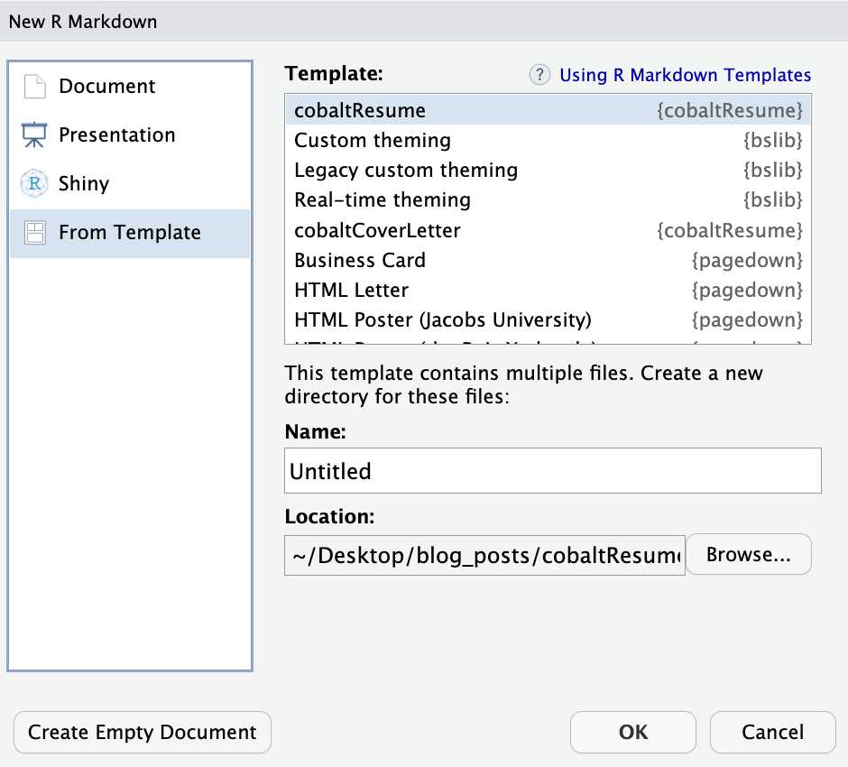

<!-- README.md is generated from README.Rmd. Please edit that file -->

```{r, include = FALSE}
knitr::opts_chunk$set(
  collapse = TRUE,
  comment = "#>",
  fig.path = "man/figures/README-",
  out.width = "100%"
)
```

# cobaltResume

The goal of cobaltResume is to create professionally-looking résumés and cover letters. 

## Installation

You can install the development version of cobaltResume from [GitHub](https://github.com/) and load it into your session with:

```{r eval=F}
# install.packages("devtools")
devtools::install_github("sciarraseb/cobaltResume")
library(cobaltResume)
```

## Creating a résumé
This is a change 

Résumés can be created by first creating an R Markdown file with the cobaltResume template.


```{r, echo=FALSE, out.width="50%", out.height="50%", fig.cap="Creating a résumé from the cobaltResume template."}

```


Résumés can be completed by using three features in resume template . First, information related to identification and skills can be included in the résumé by filling in the appropriate YAML header variables. 

```{yaml}
firstName: "firstName"
lastName: "lastName"
position: "Position" #job position being applied to 
date: "date" 
output: 
  pdf_document:
    template: "cobaltResume.tex"
#hyperlinks (delete or leave blank blank if not necessary/do not exist)
#escape any special characters with two backslashes (for example, see email variable)
githubLink: "github.com/user" #
githubName: "githubHandle"
personalWebsite: "personalwebsite.com"
linkedinName: "firstName lastName"
linkedinLink: "linkedin.com/in/personal_link"
email: "email\\@domain.com" 
#skills + citizenship
skills: "R, SQL, Python, LaTeX, Bash, HTML, JavaScript, CSS, Machine learning, Data science, Data visualization, Knowledge translation" #skills relevant to the job
citizenship: "Citizenship status" #e.g., work permit/study permit/Permanent resident/citizen, etc.
```


