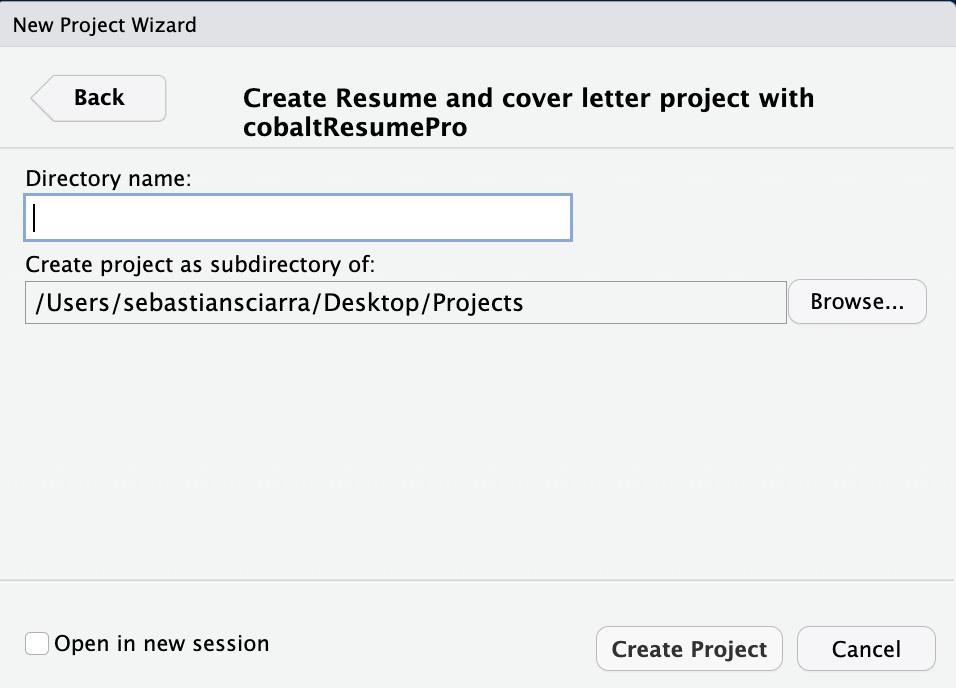

# cobaltResume 

The `cobaltResumePro` is an update on the `cobaltResumePro` package and
was designed to create resumes with a more streamlined and professional
design (the design for the cover letters remained the same in the
`cobaltResumePro` package). LaTeX code has been written in the
`cobaltResume.cls`, `cobaltCoverLetter.cls`, `cobaltResume.tex`, and
`cobaltCoverLetter.tex` files to format the resume and cover letter
files. I have written my own resume and cover letter using
`cobaltResume`, which can be viewed [my
resume](https://github.com/sebsciarra/cobaltResumePro/blob/main/man/resume_cover_letter.pdf).
Note that the cover letter is populated with placeholder content. In the
five sections that follow, I will explain the following components to
using `cobaltResumePro`:

1)  Installation
2)  Project creation
3)  Creating a resume
4)  Creating a cover letter
5)  Merging the resume and cover letter into one PDF file

## 1) Installation

You can install the development version of cobaltResume GitHub and load
it into your session with:

``` r
#install.packages("devtools")
devtools::install_github("sebsciarra/cobaltResumePro")
library(cobaltResumePro)
```

## 2) Project creation

To create a `cobaltResumePro` template, click on **File** \> **New
Project** \> **New Directory**. Then select **Resume and cover letter
project using cobaltResumePro** from the drop-down menu as shown below.


Then, give your project a name and specify where you’d like the files to
appear. In the screenshot below, the project name is
`my_resume_cover_letter` will appear as a new folder on the Desktop.



## 3) Creating a resume

In the `resume.Rmd` file, a resume can be completed by using three
features. First, information related to identification and skills can be
included in the resume by filling in the appropriate YAML header
variables shown below. Importantly, make sure that `keep_tex: true`, or
else the PDF for the resume will not be created.

``` yaml
firstName: "firstName"
lastName: "lastName"
position: "Position" #job position being applied to 
date: "date" 
output: 
  pdf_document:
    template: "cobaltResume.tex" #template file (do not change)
    keep_tex: true
#hyperlinks (delete or leave blank blank if not necessary/do not exist)
#escape any special characters with two backslashes (for example, see email variable)
githubLink: "github.com/user" #link to GitHub
githubName: "githubHandle" #GitHub username
personalWebsite: "personalwebsite.com"
linkedinName: "firstName lastName"
linkedinLink: "linkedin.com/in/personal_link"
email: "email\\@domain.com" 
#skills + citizenship
citizenship: "Citizenship status" #e.g., work permit/study permit/Permanent resident/citizen, etc.
```

Second, sections accessorized with fontawesome5 icons (for a full list,
see [fontawesome5
icons](http://mirrors.ibiblio.org/CTAN/fonts/fontawesome5/doc/fontawesome5.pdf)).
For example, `\faSuitcase\ Employment` results in the header shown
below. Importantly, DO NOT change the section names.


Third, resume entries can be completed for each section using the
corresponding R function. For each section, the following R function
should be used:

1)  Profile: `create_profile_entry()`
2)  Skills: `create_skills_entry()`
3)  Education: `create_education_entry()`
4)  Selected white papers: `create_white_paper_entry()`
5)  Employment experience: `create_resume_entry()`
6)  Data science experience: `create_resume_entry()`

``` r
create_profile_entry(profile_summary = "Passionate about coding, machine learning, and statistics. Completed my PhD \\href{\\detokenize{https://atrium.lib.uoguelph.ca/server/api/core/bitstreams/8ed1891d-58ca-457b-b0d4-33a015fb2db9/content}}{\\textcolor{blue}{dissertation}} at the intersection of these fields to address a practical problem in Industrial-Organizational psychology and received the 2022/2023 Canadian Psychological Association Certificate of Academic Excellence for this work. In my dissertation, I coded and ran Monte Carlo simulations on an AWS instance to evaluate the performance of nonlinear longitudinal models. Writes white papers on machine learning topics at\ \\href{https://sebastiansciarra.com}{\\textcolor{blue}{sebastiansciarra.com}}. \\newline")

create_skills_entry(coding_languages = c("Python", "R", "SQL", "\\LaTeX", "Javascript", "HTML", "CSS"), 
                    ides_platforms = c("PyCharm", "RStudio", "AWS", "Git", "MySQL"), 
                    technical_skills = c("Data visualization (ggplot2, plotnine)", 
                                         "Data cleaning (tidyverse, pandas, numpy)", 
                                         "Machine learning (e.g., regularized regression, decision trees, random forests, mixture models)", 
                                         "Statistics (e.g., latent variable models, factor analysis, multilevel modelling)"))
```

Note that LaTeX code can be inserted and will be rendered. The above two
examples produce the following two entries in the resulting PDF file:


## 4) Creating a cover letter

In the `cover_letter.Rmd` file, a cover letter can be completed by using
three features. First, information related to identification and skills
can be included in the résumé by filling in the appropriate YAML header
variables shown below.

``` yaml
firstName: "firstName"
lastName: "lastName"
position: "Position" #job position being applied to 
date: "date" 
output: 
  pdf_document:
    template: "cobaltCoverLetter.tex"
#hyperlinks (delete or leave blank blank if not necessary/do not exist)
#escape any special characters with two backslashes (for example, see email variable)
githubLink: "github.com/user" #link to GitHub
githubName: "githubHandle" #GitHub username
personalWebsite: "personalwebsite.com"
linkedinName: "firstName lastName"
linkedinLink: "linkedin.com/in/personal_link"
email: "email\\@domain.com" 
#recruiter info 
recruiterName: "Recruiter Name"
organization: "Organization Name"
organizationStreet: "200 Bay St."
organizationCityPostal: "Toronto, ON M5J 2J2"
#greeting/closing + citizenship
greeting: "Dear Mr./Mrs. Recruiter Name"
emailClosing: "Sincerely"
citizenship: "Citizenship status" #e.g., work permit/study permit/Permanent resident/citizen, etc.
```

## 5) Merging the resume and cover letter into one PDF

To merge the resume and cover letter into one PDF, make sure that each
`.Rmd` file exists in its own folder (as is the case when the project is
first created). With the resume and cover letter `.Rmd` files in their
own folders, they can be merged by specifying the `knit` YAML variable
in either the `résumé .Rmd` and/or the `cover_letter.Rmd` file(s) such
that

``` yaml
knit: cobaltResumePro::knit_resume(merge_resume_cover_letter = T)
```
